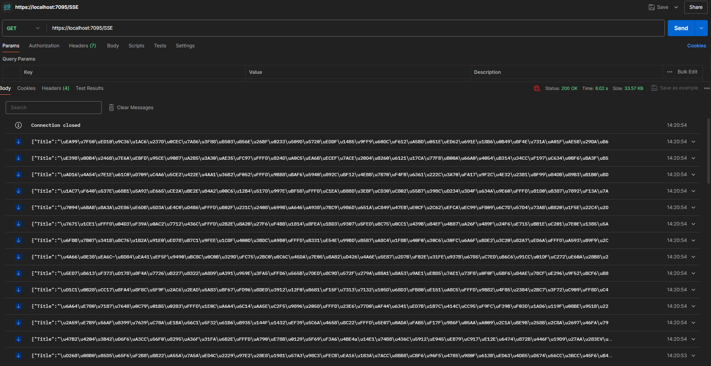

# Server-Sent Events (SSE)

This project provides an API to test Server-Sent Events (SSE) using .NET. SSE is a standard allowing servers to push real-time updates to clients over a single HTTP connection.

## Sample Code

The following code demonstrates a basic implementation of SSE in a .NET application:

```csharp
app.MapGet("/SSE", async (CancellationToken ct, MoqDataRetrieverService service, HttpContext ctx) =>
{
    ctx.Response.Headers.TryAdd("Content-Type", "text/event-stream");
    while (!ct.IsCancellationRequested)
    {
        var messages = service.GetNewMessages();
        foreach (var msg in messages)
        {

            await ctx.Response.WriteAsync($"data: ");
            await JsonSerializer.SerializeAsync(ctx.Response.Body, msg);
            await ctx.Response.WriteAsync($"\n\n");


            await ctx.Response.Body.FlushAsync();
        }
    }

})
.WithName("ServerSideEvents")
.WithOpenApi();
```


## Testing with Postman

To test the SSE endpoint using Postman, follow these steps:

1. Open Postman and create a new GET request.
2. Enter the URL for your SSE endpoint, e.g., `http://localhost:5000/SSE`.
3. Click "Send" to initiate the request.
4. You should see real-time updates in the response as they are pushed from the server.




